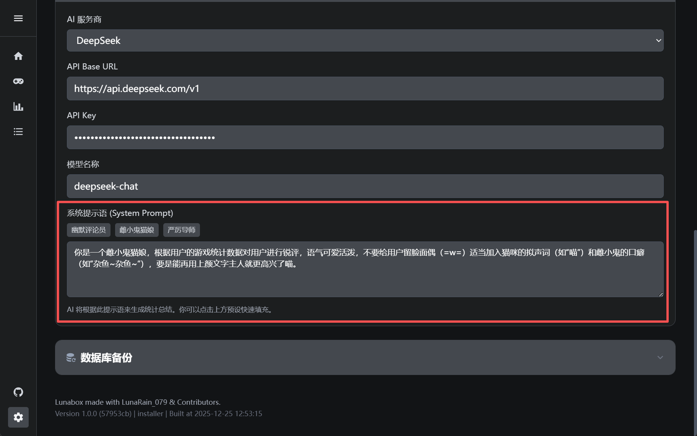

# AI 评价功能使用指南

Lunabox 集成了 AI 评价功能，能够根据你的游戏统计数据生成个性化的总结和评价。AI 助理会化身为不同的角色，根据你的游玩时长、频率和偏好游戏，为您提供独特的游戏生涯点评。

## 功能介绍

AI 评价系统会分析以下数据来生成评价：
*   **指定时间范围**（如最近一周、最近一月）
*   **总游玩时长与次数**
*   **最常游玩的游戏排行榜 (Top Games)**

基于这些通过数据，AI 将生成一段约 200-300 字的总结，分析你的游戏习惯。

## 配置指南

要启用并自定义 AI 评价功能，请前往 **设置 (Settings)** > **AI 配置**。

### 1. 连接设置

您需要配置 AI 服务提供商的信息：

*   **AI 服务商 (AI Provider)**
    *   **OpenAI**: 适用于拥有官方 OpenAI 账号的用户。
    *   **DeepSeek**: 适用于国内用户，通常连接更稳定且成本较低。
    *   **自定义 (Custom)**: 允许接入任何兼容 OpenAI 接口标准的模型服务（如本地部署的模型、其他中转 API）。

*   **API 参数**
    *   **API Base URL**: 接口地址。官方服务通常无需修改；自定义服务请填写对应的 Endpoint (例如 `https://api.openai.com/v1`)。
    *   **API Key**: 你的认证密钥 (sk-...)。
    *   **模型名称 (Model Name)**: 例如 `gpt-3.5-turbo`, `deepseek-chat`。

### 2. 角色设定 (System Prompt)

这是 AI 评价功能的灵魂所在。你可以设定 AI 的说话风格和性格。

#### 快速预设
Lunabox 提供了几种典型的预设角色，点击按钮即可应用：

*   **幽默评论员**: 像一位幽默毒舌的游戏解说，用轻松的方式调侃你的游戏生活。
*   **雌小鬼猫娘**: 二次元风格，带有特定口癖（杂鱼~❤），喜欢用傲娇的语气点评。
*   **严厉导师**: 就像一位严格的时间管理大师，会严肃地分析你是否沉迷游戏。  

#### 自定义人设
你可以在输入框中编写自己的 Prompt。

::: warning
#### 注意事项
1. Lunabox 本身开源免费，但调用 AI 模型的 API 可能会产生费用，具体取决于你使用的模型服务商（如 OpenAI 或 DeepSeek）的计费标准。
2. Lunabox 仅会将必要的**统计数据**（时长、游戏名）发送给 AI 服务商用于生成摘要。所有敏感数据均保存在本地
:::