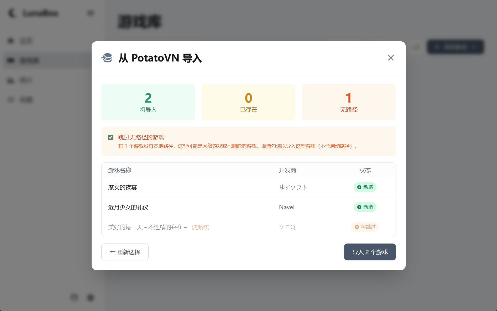

# 从PotatoVN导入数据

LunaBox 支持从 [PotatoVN](https://potatovn.net/) 导入游戏数据，方便用户快速建立游戏库。请按照以下步骤操作：

## 1. 准备工作
确保您已经在电脑上安装并使用过 PotatoVN，并且有可用的游戏数据。

## 2. 导出 PotatoVN 数据
打开 PotatoVN，选择设置 -> 其他设置 -> 导出数据，保存备份数据到本地磁盘。

## 3. 导入数据
- 在游戏库页面，点击 **添加游戏** 按钮，选择 **从 PotatoVN 导入** 选项。
- 在弹出的文件选择对话框中，找到并选择之前导出的 PotatoVN ZIP 数据文件。
- 系统会自动预览将要导入的游戏列表，您可以查看哪些游戏将被导入、哪些已存在、哪些没有路径。

## 4. 导入选项说明

- 您可以选择是否跳过没有路径的游戏（这可能是PotatoVN的网络游戏功能）。
- 点击 **导入** 按钮，LunaBox 会自动解压文件、解析 data.galgames.json 并导入游戏数据。

::: info
#### 数据映射说明
LunaBox 会自动将 PotatoVN 的数据映射到本地格式：
- 游戏名称、开发商、描述等基本信息
- 游戏执行文件路径
- 游戏封面图片（如果有）
- 数据源类型（Bangumi、VNDB、Ymgal 或 Local）
- 添加时间等元数据
:::

::: warning
**一切出现的数据问题，作者概不负责，请谨慎操作**
:::
## 5. 确认导入结果
导入完成后，您可以在游戏库中查看导入的游戏列表。系统会显示导入成功、跳过和失败的游戏数量，确保所有数据正确无误。LunaBox 会跳过已存在的游戏，避免重复导入。